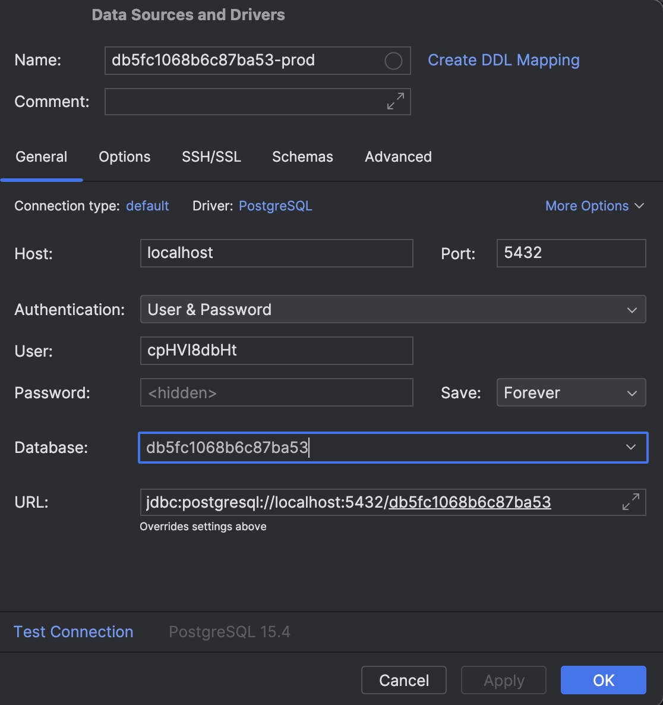

# Database setup

There is an RDS instance in each of the namespaces (dev, preprod and prod). Table migrations have been applied to each of them. This page describes how to interact with the databases and update the tables.

## Connecting to the database
**1.** To connect to the database you will need to find out the key environment variables for each instance. First run

`kubectl get pod -n < namespace >`

to see all of the pods in the namespace. You will need to look inside the API pods (as opposed to the UI pods), because those are where the database interaction happens within the application. 

**2.** Run the following command to see all the environment variables set in the pod:

`kubectl exec -it < api pod name > -n < namespace > -- env`

The variables you will need are **DATABASE_NAME**, **DATABASE_USERNAME**, **DATABASE_PASSWORD** and **DATABASE_ENDPOINT**.


**3a.** To connect to the database we use a port-forward pod. These have already been set up in each namespace, but being ephemeral and not managed by a Kubernetes Deployment they will not live permanently. The command to create them is:
```Shell
kubectl \
  -n < namespace > \
  run port-forward-pod \
  --image=ministryofjustice/port-forward \
  --port=5432 \
  --env="REMOTE_HOST= < DATABASE_ENDPOINT with the port removed from the end > " \
  --env="LOCAL_PORT=5432" \
  --env="REMOTE_PORT=5432"
  ```


**3b.** Then run

`kubectl port-forward port-forward-pod 5432:5432 -n < namespace >`

This sets up the redirection of traffic.


**4.** You can then connect to the database using the variables you extracted earlier.

An example configuration for connecting via the IntelliJ IDE can be seen below:



The 'Name' field at the top is for your own convenience; you can call it anything you like.
The 'Host' field should be localhost, and 'Port' will be 5432 if you used the same ports as the previous commands. This is what the port-forwarding does for you.

The Authentication should use 'User & Password'. 'User' is DATABASE_USER, 'Password' is DATABASE_PASSWORD and 'Database' is DATABASE_NAME. The 'URL' field autocompletes based on the fields above.

Hit 'Test Connection' to confirm your connection. You should see a green tick if everything is working.

## AWS console
The databases can be viewed via the console at https://eu-west-2.console.aws.amazon.com/console/home?region=eu-west-2#, as long as you are in the MOJ GitHub organisation and a member of the hmpps-subject-access-request GitHub team. 

You can search for the DATABASE_NAME, removing the leading 'db' (eg. to find database db5fc1068b6c87ba53, search for 5fc1068b6c87ba53). If you don't see anything, double-check that you have the 'eu-west-2' region selected.


## Migrations
Migrations are run using Flyway, a higher-level database migration tool. The migrations happen upon application startup and run according to the contents of hmpps-subject-access-request-api/src/main/resources/db/migration. 

Flyway keeps a record of each file which has been used in a migration, so each file will only be used once. When connected to the database you should be able to see two tables - subject_access_request and flyway_schema_history. In the latter you should see an entry for each migration. 

To make changes to the schema a new SQL file must be made in the db/migration directory. 