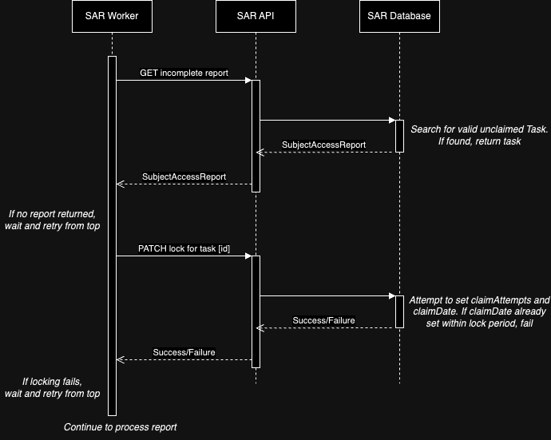

# Asynchronous Worker Architecture

- **Decision ID**: 1
- **Title**: Asynchronous Worker Architecture
- **Date**: 2024-02-01
- **Status**: Pending

## Context

When a Subject Access request is raised, it is important that the request is fully processed by going to all of the specified API endpoints and retrieving and compiling all of their data on a subject. This ADR discusses our design for a worker that can handle the fulfillment of SAR report generation.

## Option A

The original proposal was to use a queue in order to decouple the raising of a SAR request from the handling of it in the SAR worker. In this approach, the flow is as follows:

- *SAR Worker* polls the *SAR SQS Queue* waiting for a message.
- *SAR API* receives a request for a new SAR report. The details are written to the database for storage and a task is added to the *SAR SQS Queue*.
- (optional) *SAR Worker* makes a request to the *SAR API* to retrieve full details of the report to be generated, if eg. only a task ID is written to the *SAR SQS Queue*
- *SAR Worker* fulfills the SAR report by making calls to every requested upstream API and aggregating them into a PDF as requests are received.
- Once the report is generated, *SAR Worker* uploads the report to document storage, marks the task as having been successfully handled to remove it from the queue, and updates the record via the *SAR API* to "Complete".

## Option B

The alternative proposal was originally raised by Ben Pitt and the team have since done workshops in order to reduce the number of moving parts and use the database as the definitive source of truth on which reports still need to be fulfilled. In this approach, the flow is as follows:

- *SAR Worker* polls the *SAR API* on an infrequent interval to request a new task.
- When polled, the *SAR API* checks the database for any reports matching the following:-
    - Report status is not set to 'Complete'
    - Report's last claimed date is either unset or not within the lock period[^1]
- If any results are found, return the task details.
- *SAR Worker* makes a PATCH request to set a lock on the report so no other worker can work on the same task.
- *SAR API* sets a lock in the database by updating the claimDate if and only if the claimDate is already within the lock period[^1]
- *SAR Worker* fulfills the SAR report by making calls to every requested upstream API. The remaining process is the same for both approaches.

[^1]: The lock period will be set to the longest time that we expect report generation to take and may need to be tweaked (similarly to an SQS queue's visibility timeout).

## Team Decision

As a team, we have decided to proceed with Option B. This is for the following benefits:-

- Fewer pieces of infrastructure results in fewer potential failure points.
- Less infrastructure setup and configuration.
- Single source of truth with regards to incomplete tasks.

