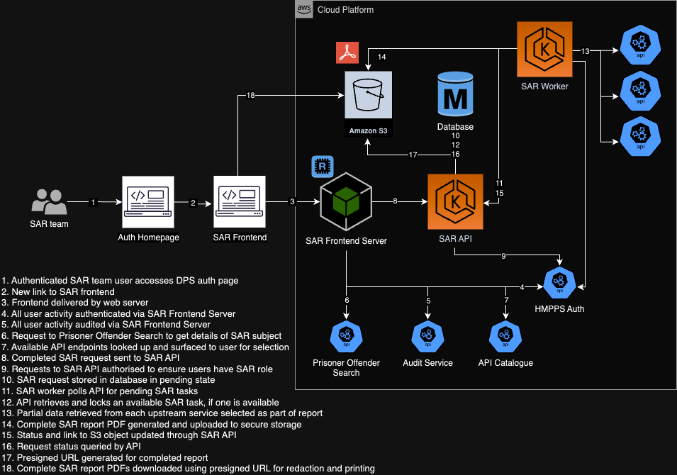

# Technical Design

## Components

- **SAR Frontend** - Interactable UI components that run in the user's browser
- **SAR Frontend Server** - Backend-For-Frontend server that handles routing, template rendering and interfacing with APIs
- **SAR API** - Central API that handles storage, updating and retrieval of Subject Access Requests within the system
- **SAR Worker** - Separate worker processes that asynchronously fulfill Subject Access Requests by fetching and collating all the requested data from other services
- **Report S3 Bucket** - Secure document storage for completed reports
- **SAR Database** - Source of truth for all created, in-flight and completed Subject Access Requests

## Updates

Updates to the technical design can be made by opening [technical-design.drawio.png](technical-design.drawio.png) in [draw.io](draw.io)

Once you have made the changes:
- go to `File/Export As/PNG`
- Ensure the following settings:-
    - `Appearance` is set to `Dark`
    - `Include a copy of my diagram` is checked
    - All other settings are left at their default values
- Click Export and update the file in the repository

> [!IMPORTANT]
> Ensure that any new components, or components that have changed significantly in purpose, are updated in the component list above.